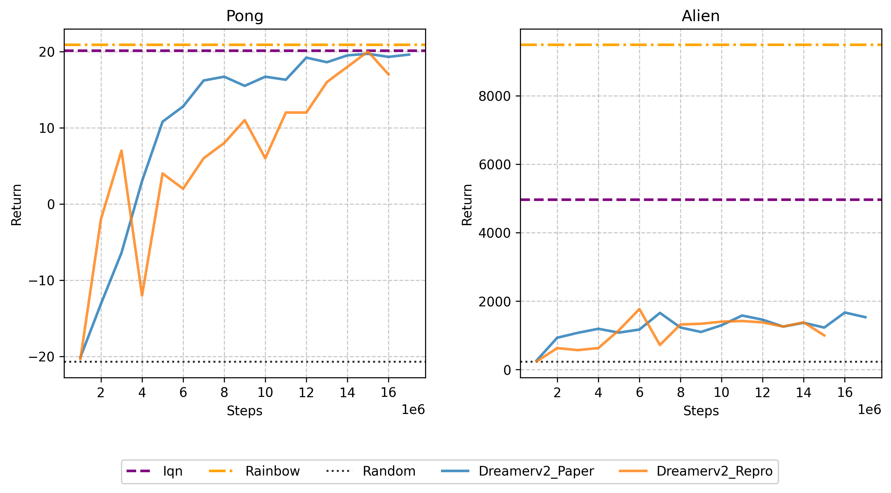
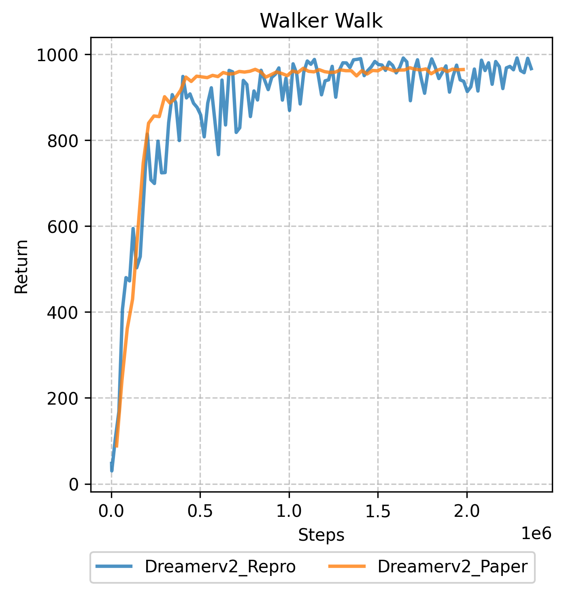
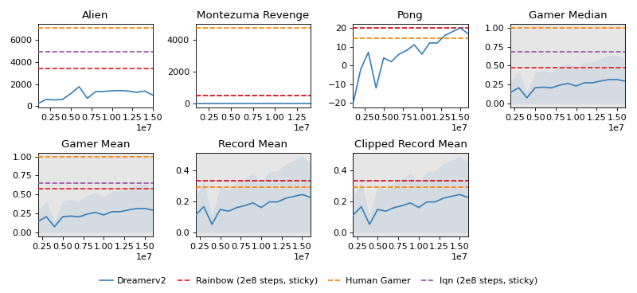
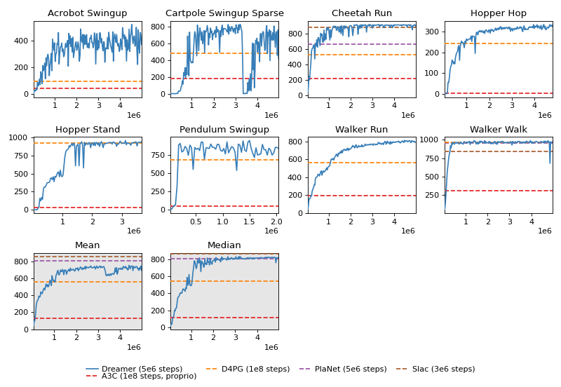
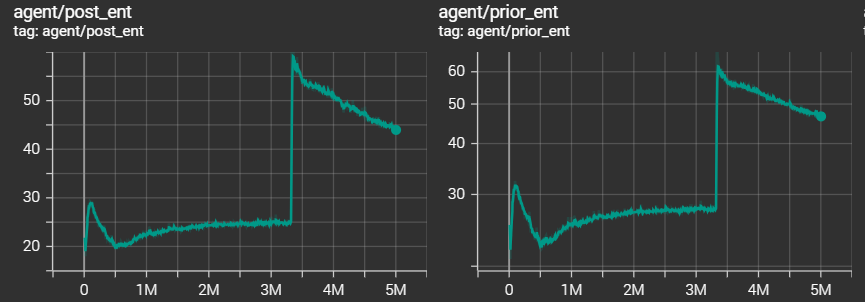
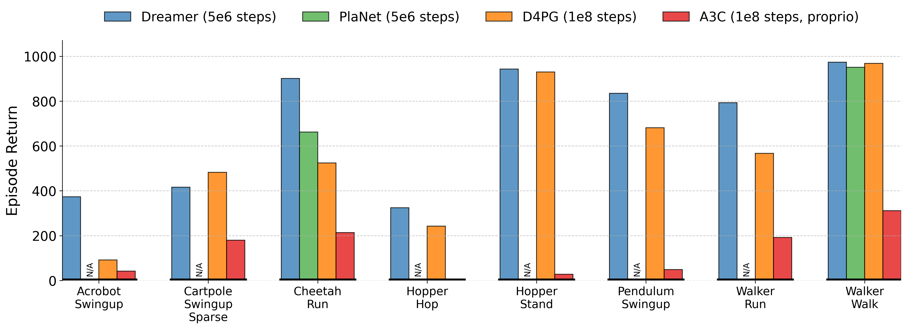
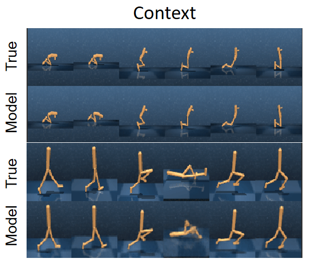
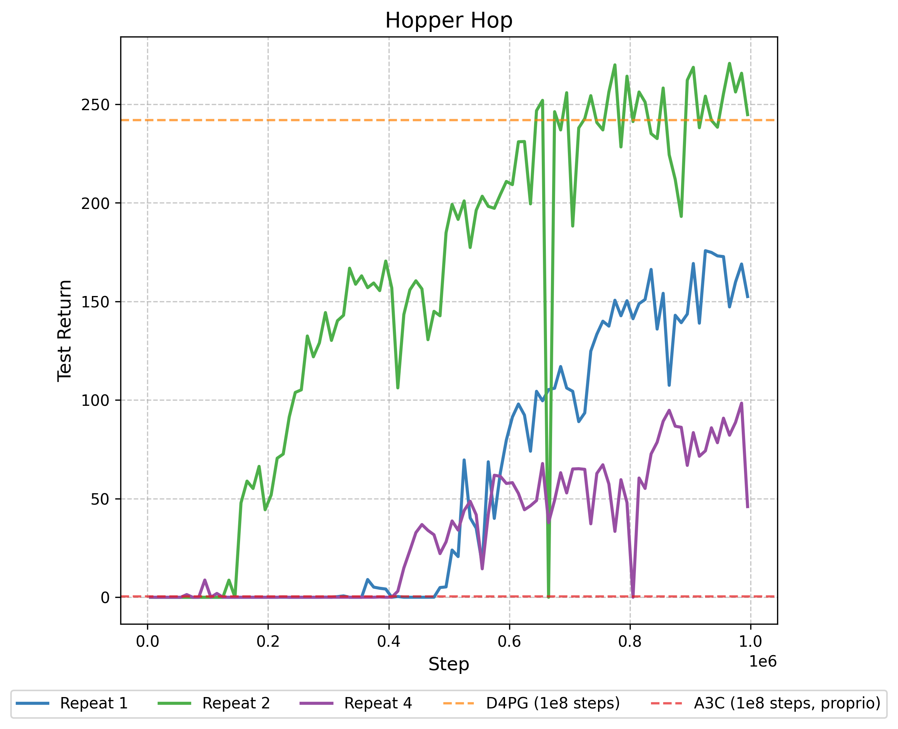
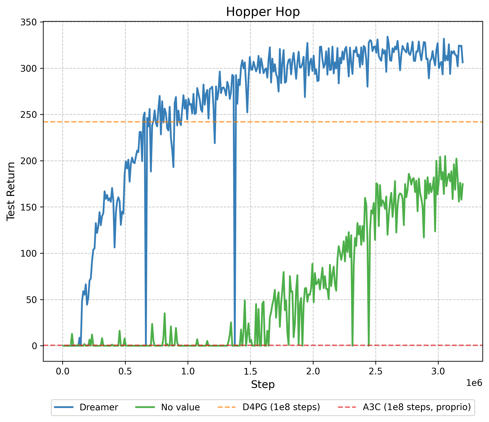
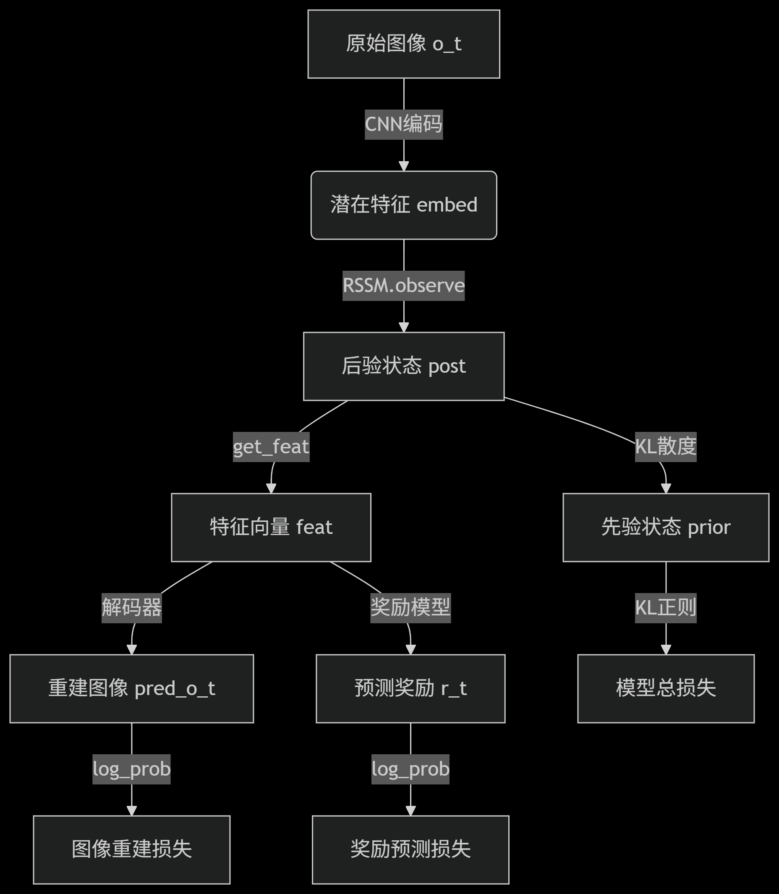

进度:

`6`月中旬(期末复习带着配置)尝试配置`dreamerv2`环境.(由于之前寒假当时配planet环境版本较旧遇到了不少问题于是考虑先配`dreamerv2`,离得近些)

配置`mujoco+dm_control`遇到了一些问题,多次尝试后解决.安装方法见`dm-control+mujoco安装教程.txt`.

按照网站说明配置各个环境.遇到较多例如版本不兼容问题,参考了网站`https://tencentcloud.csdn.net/676293c6f3b8a55e4e989994.html`等.最终测试可用的`conda list`各个版本见`something_useful.txt`.
(改了例如`gym, pip`等等版本,具体记不清了,不过最后`conda`虚拟环境测试能用)
意料之外地但是确实还用了挺多时间.
 
dreamerv2论文运行测试: 用的默认的`dmc_walker_walk(1e8)`和`atari_pong(4×5e7=2e8)`,看论文说`DreamerV2 reaches 200M environment steps in under 10 days, while using only a single NVIDIA V100 GPU and a single environment instance.days`,尝试跑了下然后时间确实很长于是考虑先跑一跑短一点的`dreamer(5e6)`(初步看了下代码框架也就没有去做消融实验).(没有预估好在服务器上跑到差不多一千六百万时候存储不够终止了)

下面是`dmc`和`atari`的运行结果和论文结果的大致比较示意图:

<!-- 通过style属性设置宽度和高度,建议只设置宽度,高度会等比例缩放 -->

下面是对原来的`plot.py`代码适当修改后绘制的包含四个评价指标的图像:

`Montezuma Revenge`任务一直为`0`,和论文中比较应该是`discount`没有设置成论文中调整的`0.99`然后训练时间还不够.

暂时转向了`dreamerv1(dreamer)`.`Dreamerv2`的绘图程序相较`Dreamer`似乎更加完善.于是考虑将`dreamerv2`的绘图方法直接用到`dreamer`中,并做了适当修改.

选择`dreamer`论文中`Figure 7`的`8`个任务(`Acrobot Swingup, Cartpole Swingup Sparse, Hopper Hop, Hopper Stand, Pendulum Swingup, Quadruped Walk, Walker Run, Walker Walk`, 然后考虑到`Quadruped Walk`没有几个可对比的`baselines`,于是换成了`Cheetah Run`). 结果如下图:

和原论文基本一致.(`Cartpole Swingup Sparse`有过一段急剧下降,但是又迅速上升到基本原来的高`return`,没有太大影响.可能是智能体为了探索新策略(如尝试更激进的摆杆动作),会主动采取随机行为.若探索的新动作导致摆杆频繁倒地、偏离目标,奖励会急剧下降(对应曲线下跌段)),从下面的熵值图也可以看出.

类似原论文`Figure 6`绘制了四种方法的`return`对比柱形图(对`plotting.py`作了一些修改).和原论文对比基本类似.`Dreamer`较其他三种模型`return`更高.

对原论文`Figure 5`左半图的绘制(选择的任务为`Hopper Stand`和`Walker Walk`):

`reconstruction model`得到的图像一定程度上能够反应真实图像信息.

消融分析:

(由于运行时长原因,仅选取一个dmc任务对比分析,这里选取`Hopper Hop`任务(需要`long horizon`))

1.对比了附录`F`所示的动作重复次数对`return`的影响,默认设置`action_repeat = 2`确实`return`最高,但是和论文不同的是论文的曲线显示`Repeat 4`整体比`Repeat 1`的`return`要高,但是我们绘制的如下曲线显示并非如此.

2.对比了`Figure 7`对于是否有`value model`对`return`的影响(对`dreamer.py`略做了改动,相应地添加一个`config.no_value`标记).

可见若仅通过动作模型或在线规划优化 “想象视野内” 的奖励,会产生短视行为,而`Dreamer`在需要长视野信用分配的视觉控制任务(如该`hopper`任务)中取得成功.

3.`Dreamer + Reconstruction`和`Dreamer + Contrastive`的`return`对比.原论文在`4 LEARNING LATENT DYNAMICS`部分给出了两种损失的定义，差距仅在于 $\mathcal{J}_\text{O}^t$(观测重建项,对应`Observation model`) 和 $\mathcal{J}_\text{S}^t$(对比损失项,对应`State model`), 而 $\mathcal{J}_\text{R}^t$(奖励预测项,对应`Reward model`) 和 $\mathcal{J}_\text{D}^t$(`KL`正则项(约束表示模型(后验)和转移模型(先验)的分布接近))是一致的.附录B似乎证明了$\mathcal{J}_\text{O}^t \ge \mathcal{J}_\text{S}^t$, 所以`Dreamer + Reconstruction`应该效果上要比`Dreamer + Contrastive`要强.

已知`reconstruction`在`dreamer.py`的实现代码流程大致如下(主要在`_train`函数中):

正在尝试实现`contrastive`方法,目前还没有成功.正在进一步阅读`dreamerv1`代码实现细节.